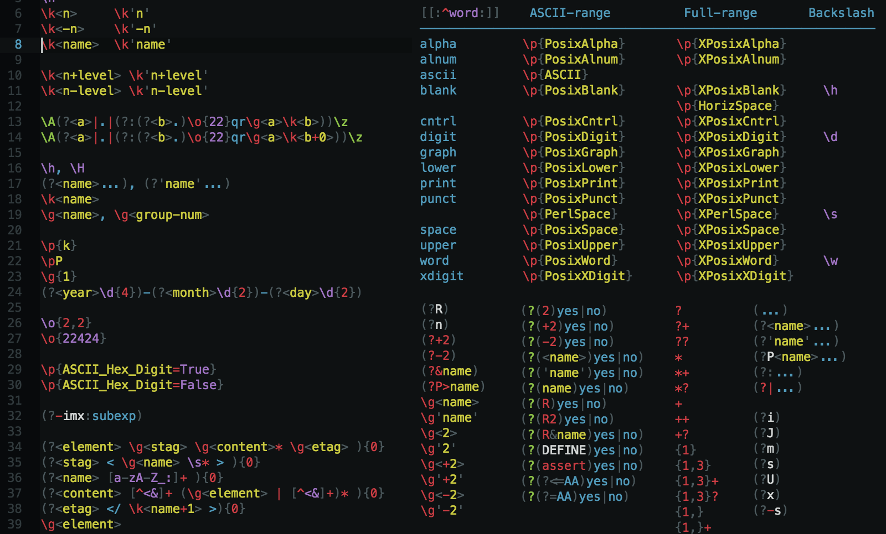

Regular expression highlighting
===============================
Bleeding edge, engine-agnostic highlighting for regular expression data.

If regular expressions were an actual language, this would be its official package.
